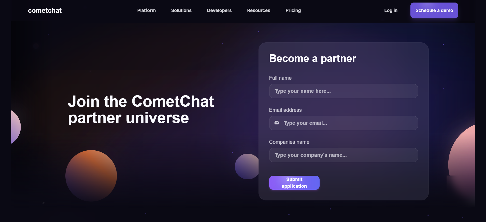

# Comet chat assingment

A modern, responsive React application built with cutting-edge technologies and stunning 3D animations. This project showcases a partnership-focused platform with beautiful UI components and smooth interactions.

## 🚀 Features

- **Modern React 18** with TypeScript for type safety
- **Responsive Design** that works seamlessly across all devices
- **3D Animations & Effects** with smooth transitions and interactions
- **Dark Theme** with cosmic-inspired color scheme
- **Component Library** built with Radix UI primitives
- **Form Handling** with React Hook Form and validation
- **Smooth Animations** with intersection observers and scroll effects
- **Professional UI Components** including accordions, buttons, cards, and more

## 🛠️ Tech Stack

### Core Framework

- **React 18** - Modern React with latest features
- **TypeScript** - Type-safe JavaScript development
- **Vite** - Fast build tool and development server

### Styling & UI

- **TailwindCSS 3** - Utility-first CSS framework
- **Radix UI** - Accessible UI components
- **Class Variance Authority** - Component variant management
- **Lucide React** - Beautiful SVG icons
- **Framer Motion** - Animation library


### Development Tools

- **ESLint** - Code linting
- **Prettier** - Code formatting
- **Vitest** - Fast unit testing

## 📦 Installation

1. **Clone the repository**

   ```bash
   git clone <repository-url>
   cd project
   ```

2. **Install dependencies**

   ```bash
   npm install
   ```

3. **Start the development server**

   ```bash
   npm run dev
   ```

4. **Open your browser**
   Navigate to `http://localhost:8080`

## 🏗️ Available Scripts

- `npm run dev` - Start development server
- `npm run build` - Build for production
- `npm run preview` - Preview production build
- `npm run typecheck` - Run TypeScript type checking
- `npm run test` - Run tests
- `npm run format.fix` - Format code with Prettier

## 📁 Project Structure

```
project/
├── src/
│   ├── components/          # Reusable UI components
│   │   ├── ui/             # Base UI component library
│   │   ├── Header.tsx      # Navigation header
│   │   ├── Hero.tsx        # Hero section
│   │   ├── PartnersSection.tsx
│   │   ├── PartnerAdvantages.tsx
│   │   ├── PartnershipPrograms.tsx
│   │   ├── FAQ.tsx         # Frequently asked questions
│   │   ├── Footer.tsx      # Site footer
│   │   └── Enhanced3D.tsx  # 3D components and effects
│   ├── hooks/              # Custom React hooks
│   │   ├── use-mobile.tsx  # Mobile detection hook
│   │   └── use-toast.ts    # Toast notification hook
│   ├── lib/                # Utility libraries
│   │   ├── utils.ts        # General utilities
│   │   └── animations.ts   # Animation utilities
│   ├── pages/              # Page components
│   │   ├── Index.tsx       # Home page
│   │   └── NotFound.tsx    # 404 page
│   ├── App.tsx             # Main app component
│   ├── main.tsx           # App entry point
│   └── index.css          # Global styles
├── public/                 # Static assets
├── components.json         # Shadcn/UI configuration
├── tailwind.config.ts     # TailwindCSS configuration
├── tsconfig.json          # TypeScript configuration
├── vite.config.ts         # Vite configuration
└── package.json           # Project dependencies
```

## 🎨 Key Components

### Header

- Responsive navigation with smooth animations
- Mobile-friendly hamburger menu
- Scroll-based styling changes

### Hero Section

- Eye-catching title with animated text
- Contact form with validation
- 3D background effects

### Partners Section

- Animated partner cards
- Hover effects and interactions
- Responsive grid layout

### FAQ Section

- Accordion-style questions and answers
- Smooth expand/collapse animations
- Accessible keyboard navigation

### 3D Components

- Interactive 3D cards with tilt effects
- Floating animations
- Mouse-following spotlight effects
- Parallax backgrounds

## 🎯 Features Breakdown

### Animations

- **Intersection Observer** - Elements animate as they enter viewport
- **Magnetic Elements** - Mouse-following hover effects
- **Parallax Scrolling** - Background elements move at different speeds
- **Smooth Transitions** - All interactions have polished animations

### Responsive Design

- **Mobile-First** approach with TailwindCSS
- **Breakpoint System** - Optimized for all screen sizes
- **Touch-Friendly** - Mobile interactions are smooth and intuitive

### Accessibility

- **ARIA Labels** - Proper screen reader support
- **Keyboard Navigation** - All interactive elements are keyboard accessible
- **Focus Management** - Clear focus indicators
- **Semantic HTML** - Proper heading hierarchy and structure

## 🔧 Development Guidelines

### Code Style

- Use TypeScript for all new components
- Follow the existing component structure in `src/components/ui/`
- Use TailwindCSS utility classes for styling
- Implement proper error boundaries and loading states

### Component Development

- Break large components into smaller, reusable pieces
- Use the `cn()` utility for conditional class names
- Implement proper TypeScript interfaces for props
- Add proper ARIA attributes for accessibility

### Animation Guidelines

- Use the animation utilities in `src/lib/animations.ts`
- Keep animations subtle and purposeful
- Test on mobile devices for performance
- Use `transform` and `opacity` for the best performance

## 🌟 Performance Optimizations

- **Code Splitting** - Lazy loading for optimal bundle size
- **Image Optimization** - Proper image formats and sizes
- **Animation Performance** - GPU-accelerated transforms
- **Bundle Analysis** - Regular monitoring of bundle size


## 📄 License

This project is licensed under the MIT License - see the [LICENSE](LICENSE) file for details.

## 🆘 Support

If you encounter any issues or have questions:

1. Check the existing issues in the repository
2. Create a new issue with detailed description
3. Include steps to reproduce any bugs
4. Provide your environment details (OS, Node version, etc.)

---

Built with ❤️ using React, TypeScript, and modern web technologies.
